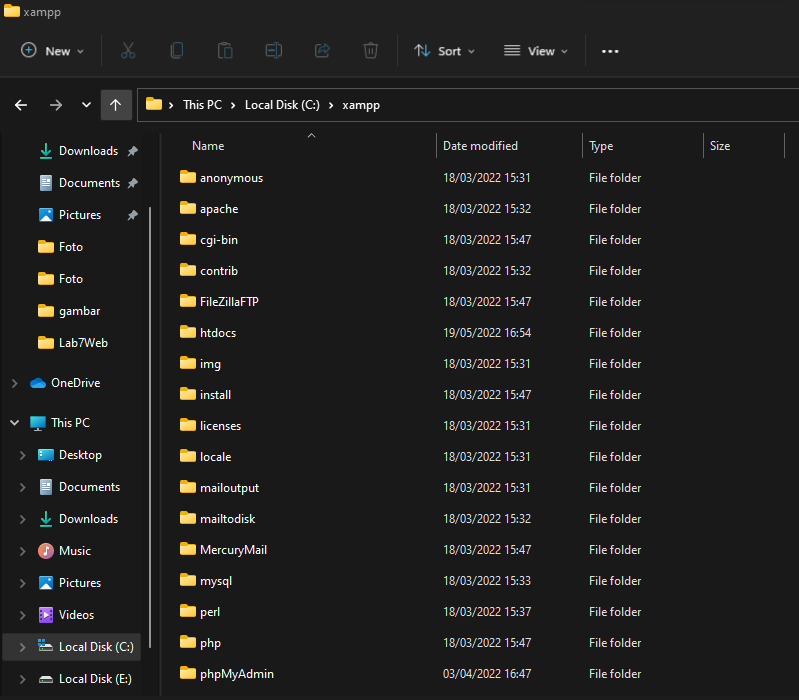
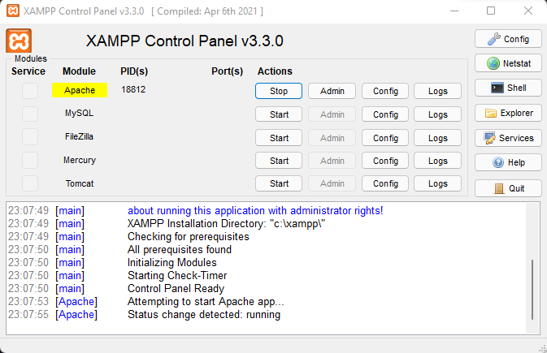
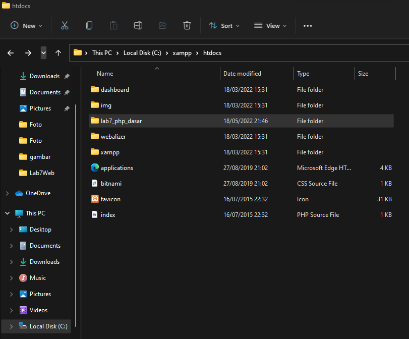
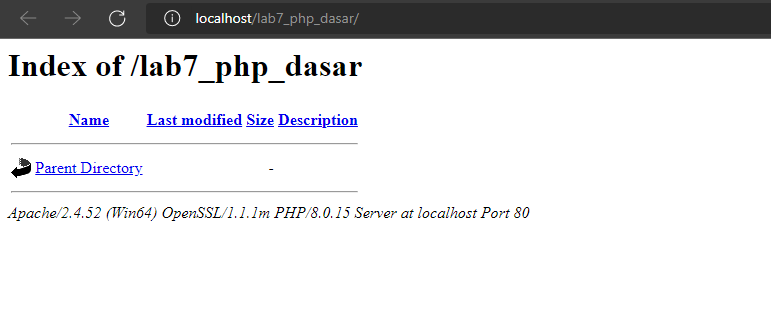
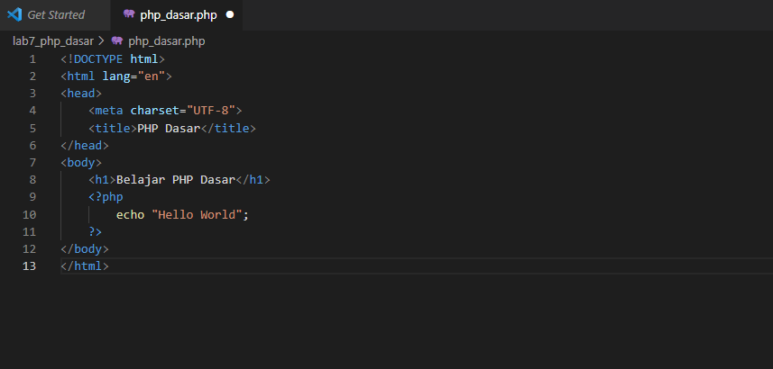
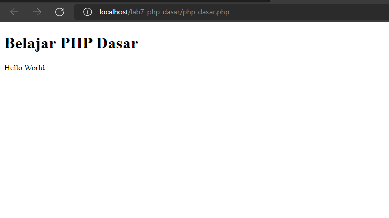

# Lab7Web
# Nama  : Muhammad Romdhon
# NIM   : 312010434
# Kelas : TI20.A1

**Langkah-langkah Praktikum**
 Untuk memulai membuat kode php, perlu disiapkan web server dan interpreter PHP terlebih dahulu. Web server yang kita gunakan adalah Apache 2 dan interpreter PHP 7. Untuk memudahkan proses praktikum, kita gunakan aplikasi bundle web server yaitu XAMPP.

# 1. Instal XAMPP
 Unduh XAMPP dari https://www.apachefriends.org/download.html dan pilih versi portebel untuk memudahkan proses installasi. Kemudian extract file tersebut, sesuaikan direktorinya.

# 2. Menjalankan Web Server
 Untuk menjalankan web server dari menu XAMPP Control.

 -Uji coba apakah server sudah berkerja dengan baik http://127.0.0.1 atau http://localhost

 Tampil halaman utama XAMPP jika server sudah bekerja dengan baik.

 -Dokumen website
 Semua file website tempatkan di direktori: \xampp\htdocs\

 -Database MySQL
 Direktori: **\xampp\mysql**

 Manajemen database: http://localhost/phpmyadmin

# 3. Memulai PHP
 Buat folder lab7_php_dasar pada root directory web server

 Kemudian untuk mengakses direktory tersebut pada web server dengan mengakses URL:
 http://localhost/lab7_php_dasar/

# 4. PHP Dasar 
  Buat file baru dengan nama **php_dasar.php** pada directory tersebut. Kemudian buat kode seperti berikut.

 Kemudian untuk mengakses hasilnya melalui URL:
 http://localhost/lab7_php_dasar/php_dasar.php

